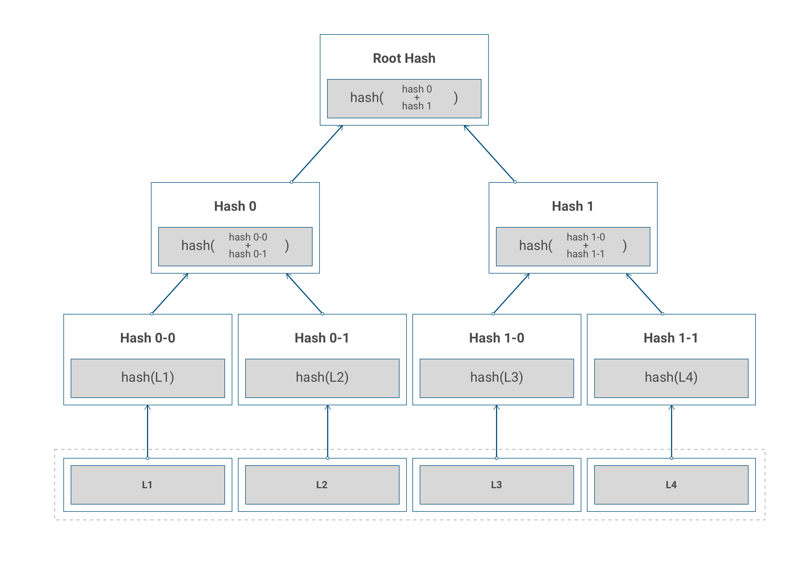
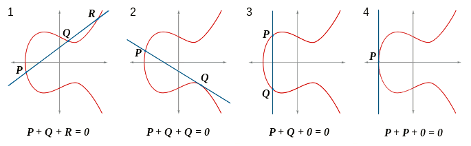

% Nanocoin - Cryptocurrencies with Haskell
% Thomas Dietert 
% August 23, 2017

Introduction 
-------------

# About me

. . .

- Haskell programming for 2.5 years

. . .

- Software Engineer at Adjoint

. . .

- I think cryptocurrencies are cool!

. . .

- I like to go Bouldering

. . .

- I'm always listening to music on Soundcloud

# Adjoint

We are implementing a *private*, asset agnostic distributed ledger and 
smart contract platform.

. . .

* Cryptography

. . .

* Distributed Systems 

. . .

* Programming Languages Theory

. . .

## Were Hiring

Talk to me after the presentation, or email me at: 

> thomas at adjoint dot io

# Nanocoin

# Motivation 

. . .

* Cryptocurrencies are _so_ hot right now

. . .

* Haskell lets you write software that doesn't break

. . .

* Cryptography is cool

. . .

* Blockchain is simple

. . .

* Distributed systems protocols should be simple

. . .

* Cryptocurrencies are easy-ish to implement

# Project Goals

. . .

* Well-documented.

. . .

* Low-dependencies.

. . .

* Using classic PoW Consensus.

. . .

* Simple P2P Protocol using UDP chatter.

. . .

* ECDSA signed & verifed Blocks & Transactions 

. . .

* Transfer Transactions


# Cryptography

. . .

- Hashing

. . .

- Finite Fields

. . .

- Elliptic Curves 

. . .

- Public/Private Key Pairs

. . .

- ECDSA

# Hash Functions

A **hash function** is a total function for which each input there is a unique,
fixed length output. To be used in safely in cryptography, it must have these properties:

Pre-image Resistance

:  Given a hash value $h$ it should be difficult to find any message $m$ such that 
$h = Hash(m)$. 

Second Pre-image Resistance

:  Given an input $m1$ it should be difficult to find different input $m2$ such that
$Hash(m1) = Hash(m2)$.

**Collision Resistance**

:  It should be difficult to find two different messages $m1$ and $m2$ such that
$Hash(m1) = Hash(m2)$. 

# Hash Functions - SHA3_256

*Strong* hash functions 

* produce output that can be thought of as a digital fingerprint of the input data. 
* the most minor changes in the input data result in dramatically different outputs.

**SHA3_256** is one of the most commonly used strong hashing algorithm, producing a fixed
256 bits of output. 

Example:
```haskell
ghci> import Data.ByteString
ghci> import Crypto.Hash (hashWith, SHA3_256)
ghci> hashWith SHA3_256 ("1234" :: ByteString)
1d6442ddcfd9db1ff81df77cbefcd5afcc8c7ca952ab3101ede17a84b866d3f3
ghci> hashWith SHA3_256 ("12345" :: ByteString)
7d4e3eec80026719639ed4dba68916eb94c7a49a053e05c8f9578fe4e5a3d7ea
```

*Hashes are usually displayed in base16 format for brevity*

# Hash Functions - Merkle Trees

A **Merkle Tree** is a binary tree of hashed data, constructed from the leaves up in which sibling
nodes are hashed together to create the parent nodes.

 

* Merkle Root changes if the hash of a single leaf changes
* Leaves are usually network transactions
* Merkle Proofs are powerful

# Hash Functions - Merkle Trees (cont)

Implementation:

```haskell
{- https://github.com/adjoint-io/merkle-tree -}

newtype MerkleRoot = MerkleRoot
  { getMerkleRoot :: ByteString
  } 

data MerkleTree 
  = MerkleEmpty
  | MerkleTree MerkleNode

data MerkleNode a
  = MerkleBranch {
      mRoot  :: MerkleRoot
    , mLeft  :: MerkleNode
    , mRight :: MerkleNode
  }
  | MerkleLeaf {
      mRoot :: MerkleRoot
    , mVal  :: ByteString
  }
```

# Hash Functions - Merkle Tree Proofs

A **Merkle Tree Proof** can be constructed to prove to another party that a
piece of data is part of a merkle tree, given the merkle root of the tree and
the piece of data to prove *inclusion* of. 

- Can construct in $O(2^{\log(n)})$ where $n$ is the number of leaf nodes,
without fancy data structures.

- Can verify in $O(\log(n))$, as the constructed proof contains $\log(n)$
  elements. 

The proof is a list of hashes, starting with the hash of the element in
question, followed by it's sibling, then their parent and it's sibling, etc.

Not all nodes need to store the full tree as they can query other nodes about
transaction inclusion in blocks by supplying the transaction hash and the merkle
root of the block.

# Finite Fields

## Definition (incomplete)

$$
  \mathbb{Z} = \{..., -1, 0, 1, ...\} \\
  \mathbb{F}_p = \mathbb{Z} / p \mathbb{Z} \\
  \forall x, y\in\mathbb{F}_p, \ (x + y)\in\mathbb{F}_p \\
  \forall x, y\in\mathbb{F}_p, \ (x * y)\in\mathbb{F}_p \\
  \exists g \in\mathbb{F}_p, \ \{ g^{i} \mid \forall i \in\{0,1,..,p-2\}\} \equiv \mathbb{F}_p \\
$$

## Example

$$
  \mathbb{F}_7 = \{0, 1, 2, 3, 4, 5, 6\} \\
  g = 3 \\
  1 + 5 = 6 \quad 2 + 6 = 1 \\
  4 * 1 = 4 \quad 3 * 4 = 5
$$

# ECC (Elliptic Curve Cryptography)

The general form of an **elliptic curve** is the equation: 

$$ y^{2} = x^{3} + ax + b $$

where
$$(x,y)\in\mathbb{F}_p$$

which we write as:
$$E(\mathbb{F}_p) $$

Stating that the curve's domain is defined by $(x,y)$ values in the finite field $\mathbb{F}_p$

 

# ECC - Elliptic Curves

An **Elliptic Curve** over a finite field is defined by a 6 tuple:
$$(p,a,b,G,n,h)$$ 

where

```
p = large prime 
a = curve polynomial coefficient
b = curve polynomial coefficient
G = generator base point
n = order                        
h = cofactor                      
```

But wait, they actually look like this!

 

For $E(\mathbb{F}_p)$, _all_ points except the point at *inifinity* are
generator points. 

# ECC - Elliptic Curves - Secp256k1

We are interested in *Koblitz* curves, which are a special kind of elliptic
curves where $a = 0$.

**Secp256k1** is a 256 bit *Koblitz* curve over the field $\mathbb{F}_p$ where
$p$ is the prime:

$$ p\ =\ 2^{256}−2^{32}−2^{9}−2^{8}-2^{7}−2^{6}−2^{4}−1 $$

and the curve coefficients 

$$
  a = 0 \\
  b = 7 
$$

such that

$$ y^{2} = x^{3} + 7 \\ $$

With generator point $g$ defined as:
```
G_x = 0x79BE667EF9DCBBAC55A06295CE870B07029BFCDB2DCE28D959F2815B16F81798
G_y = 0x483ADA7726A3C4655DA4FBFC0E1108A8FD17B448A68554199C47D08FFB10D4B8
```

# ECC - Public/Private Key Pairs

. . .

Points in $E(\mathbb{F}_p)$ can be multiplied by a scalar $k\in\mathbb{F}_p$

. . .

*... naturally, because multiplication is repeated addition.*

. . .

A *Private Key* in ECC is defined by a random scalar $k\in\mathbb{F}_p$

. . .

A *Public Key* in ECC is defined by a point $Q = kG$ where $G$ is the generator
point.

. . .

## ECDLP 

. . .

The *Discrete Log Problem* for ECC states that it is computationally infeasable
to find $k$ given $Q = kG$ in $E(\mathbb{F}_p)$

. . .

This is how private keys stay private!


# ECC - ECDSA

The **Elliptic Curve Digital Signature Algorithm** is actually a pair of
algorithms used to *sign* and *verify* a piece of data using ECC.

. . .

**Sign**

: To *sign* a piece of data is to combine an ECC private key and the hashed data
to produce a pair of integers (from which the private key cannot be derived). 

**Verify**

: To *verify* a signed piece of data is to mathematically prove, using the
*public key* of the signer, that the signature was produced using the data and
private key.

# ECC - Signature Algorithm

Inputs for the signing function are:

- The data as a string of bytes, $msg$.
- The elliptic curve private-key, $d$.

The **signing** algorithm will be described in terms of the curve Secp256k1, where
$p$ is the secp256k1 prime, and $G$ is it’s respective generator point:

1. Hash the document byte stream such that $z = Hash(msg)$
2. Generate a random value $k \in \{1,..,p−1\}$
3. Compute $(x,y) = kG$
4. Compute $r = x \mod p$, if $r = 0$, go back to step 1
5. Compute $s = (z + rd) / k$ , if $s = 0$, go back to step 1

The resulting $(r, s)$ pair is the signature.

# ECC - Signature Verification Algorithm

Inputs to the verification algorithm are:

- The data as a string of bytes, $msg$
- The signature $(r,s)$
- The EC public key $Q$

The output of the verification algorithm is a boolean indicating whether or not
the data was signed with the *private key* corresponding to the *public key*:

1. Compute $z = Hash(msg)$
2. Compute $t = (z \mod p) / s$
3. Compute $u = (r \mod p) / s$
4. Let $(x,y) = tG + uQ$
5. Verify that $r = x \mod p$

# ECC - ECDSA Example

An example using the `cryptonite` library in Haskell:

```haskell
ghci> import Crypto.Number.Hash (SHA3_256)
ghci> import Crypto.PubKey.ECC.ECDSA (sign, verify)
ghci> import Crypto.PubKey.ECC.Generate (generate)
ghci> import Crypto.PubKey.ECC.Types (getCurveByName, SEC_p256k1)
```

```haskell
ghci> let msg = "hello world" :: ByteString
ghci> let secp256k1 = getCurveByName SEC_p256k1
ghci> (pubKey, privKey) <- generate secp256k1
ghci> sig <- sign privKey SHA3_256 msg
ghci> verify SHA3_256 pubKey sig msg
True 
```

# Blockchain

A **blockchain** is a replicated state machine maintaining an cryptographically
verifiable immutable history of transactions.

. . . 

- Addresses

. . . 

- Transactions

. . . 

- Blocks

. . . 

- Ledger (Distributed)

. . .

# Blockchain Definitions 

**Address**

: A unique, base58 encoded value representing a public key of a node in the
network.

**Ledger**

: A mapping of *addresses* to balances. All nodes start off with 1000 Nanocoin,
and do not 

**Transaction** 

:  A data structure representing a single atomic modification to the ledger with
some extra data to prove validity.

**Block**

:  A list of ordered transactions with some extra data to prove validity.

**Blockchain** 

:  A monotonically increasing chain of blocks in which subsequent blocks 
   are verified based on the data of the preceding blocks in the chain.

# Addresses

Maps a hash of a binary encoded ECDSA Public Key to a unique, irreversible
identity that uniquely defines a participant in the network. 

* 64 bytes (32 bytes each for `x` and `y` values of the Public Key) 
* Base 58 Encoded (shorter string than base16)
* Used to identify other Nanocoin users in the network

```haskell
{- src/Key.hs -}

extractPoint :: ECDSA.PublicKey -> (Integer, Integer)
extractPoint pubkey = (x,y)
  where
    ECC.Point x y = ECDSA.public_q pubkey 
```

```haskell
{- src/Address.hs -}

deriveAddress :: Key.PublicKey -> Address
deriveAddress pub = Address (b58 addr)
  where
    (x, y) = Key.extractPoint pub
    addr   = BA.convert $ deriveHash pstr
    -- Convert x and y to bytes
    pstr   = i2osp x <> i2osp y 
```

# Addresses (cont)

Hash of ECDSA Public Key bytes is adopted from the Bitcoin Protocol:

$$
  deriveHash(bytes) = sha256 (sha256 (ripemd160 (sha256 (bytes))))
$$

```haskell
{- src/Hash.hs -}

sha256Raw :: ByteString -> Digest SHA3_256
sha256Raw x = hash x :: Digest SHA3_256

sha256Raw' :: ByteString -> ByteString
sha256Raw' = BA.convert . sha256Raw

ripemd160Raw :: ByteString -> Digest RIPEMD160
ripemd160Raw x = hash x :: Digest RIPEMD160

ripemd160Raw' :: ByteString -> ByteString
ripemd160Raw' = BA.convert . ripemd160Raw
```

```haskell
{- src/Address.hs -}

deriveHash :: ByteString -> ByteString
deriveHash = Hash.sha256Raw' . Hash.sha256Raw' . Hash.ripemd160Raw' . Hash.sha256Raw'
```

# Transactions

A `Transaction` represents an atomic, `Ledger` state modification.

```haskell
{- src/Nanocoin/Transaction.hs -}

data Transaction = Transaction
  { header    :: TransactionHeader -- ^ Denoting the type of transaction
  , signature :: ByteString        -- ^ The issuer's serialized ECC signature of the header
  } 

data TransactionHeader = Transfer
  { senderKey :: Key.PublicKey     -- ^ Public Key of transaction issuer
  , recipient :: Address           -- ^ The address to transfer Nanocoin to
  , amount    :: Int               -- ^ The amount of Nanocoin to transfer
  } 
```

# Transactions - Serialization

In order for transactions to be signed by the issuer, they must first be converted
to a string of bytes, since `cryptonite`'s `sign` and `verify` functions take
the argument data as a `ByteString`.

Nanocoin uses the `Data.Serialize` module from the `cereal` serialization library:

```haskell
{- src/Nanocoin/Transaction.hs -}

import Data.Serialize

...

instance Generic Transaction
instance Serialize Transaction
```

*Note*: This is also how transactions are encoded before being broadcast to the network.

# Transactions - Serialization (cont)

But sometimes you have to write the serialization function manually...

* The `cryptonite` library doesn't define instance of `Generic` and/or `Serialize` for
us.
* We use `PublicKey` for the `senderKey` field of `TransactionHeader`

```haskell
{- src/Key.hs -}

putPublicKey :: S.Putter ECDSA.PublicKey
putPublicKey pubKey = do 
  let (x,y) = Key.extractPoint pubKey
  putInteger x
  putInteger y

-- | UNSAFE: Does not check the validity of the point
getPublicKey :: Get ECDSA.PublicKey
getPublicKey = do
  x <- getInteger
  y <- getInteger
  pure $ Key.mkPublicKey (x,y)

-- ... this is annoying.
```
Serialization for `TransactionHeader` is written in the same way, using both
`putPublicKey` and `getPublicKey` for it's `Serialize` instance.

# Transactions - Validation

Transactions are valid given certain predicates:

1) Can the `signature` field be verified given the `senderKey` field?
2) Does the transfer issuer have enough Nanocoin to transfer?

```haskell
{- src/Nanocoin/Transaction.hs -}

data InvalidTxField
  = InvalidTxSignature Text
  | InvalidTransfer Ledger.TransferError

data InvalidTx = InvalidTx Transaction InvalidTxField
```

*Note*: When validating a transfer transaction in a block, ledger state must be
accumulated.

# Transactions - Signature Verification

To verify a transaction signature:

```haskell
{- src/Nanocoin/Transaction.hs -}

verifyTxSignature :: Ledger -> Transaction -> Either InvalidTx ()
verifyTxSignature l tx@(Transaction hdr sigBS)  = do

  -- Try to decode the serialized signature
  case S.decode sigBS of
    
    Left err -> Left $ InvalidTx tx $ InvalidTxSignature (toS err)
    
    Right sig -> do
      
      -- Try to verify the signature w/ the issuer's public key 
      let pubKey = senderKey hdr 
      let validSig = Key.verify pubKey sig (S.encode txHdr)
      
      unless validSig $ Left $ InvalidTx tx $
        InvalidTxSignature "Failed to verify transaction signature"
```

# Transactions - Transfer Validation 

Validation of the transaction header happens by attempting to transfer
Nanocoin from one `Address` to another. 

```haskell
{- src/Nanocoin/Transaction.hs -}

validateTransfer :: Ledger -> TransactionHeader -> Either InvalidTx Ledger
validateTransfer ledger (Transfer pubKey to amnt) = do
  
  -- Derive the address of the issuer's public key
  let from = deriveAddress pk
  
  -- Attempt to apply the transaction to the ledger 
  case Ledger.transfer from to amnt ledger of
    Left err -> do
      Left $ InvalidTx tx $ InvalidTransfer err
      pure ledger
    Right ledger' -> pure ledger'
```

The real implementation uses `StateT` to accumulate transaction errors.

# Blocks

Blocks are simply ordered lists of transactions, plus a few other things to help
us validate their integrity.

```haskell
{- src/Nanocoin/Block.hs -}

data BlockHeader = BlockHeader
  { origin       :: Key.PublicKey -- ^ Public key of Block miner
  , previousHash :: ByteString    -- ^ Previous block hash
  , transactions :: [Transaction] -- ^ List of Transactions
  , nonce        :: Int64         -- ^ Nonce for Proof-of-Work
  } 

data Block = Block
  { index        :: Index         -- ^ Block height
  , header       :: BlockHeader   -- ^ Block header
  , signature    :: ByteString    -- ^ Block signature
  } 
```

# Blocks - Hashing 

Block hashing is important because it is key in preserving immutability of the
block chain.

* Each block header contains a hash of the previous block
* The hash must have a certain prefix because of PoW Consensus

```haskell
{- src/Nanocoin/Block.hs -}

-- | Hash a block header, to be used as the prevHash field in Block
hashBlockHeader :: BlockHeader -> ByteString
hashBlockHeader (BlockHeader origin previousHash txs nonce) =
  Hash.sha256Raw' $
    BS.concat [ rawAddress (deriveAddress origin)
              , previousHash 
              , S.encode txs 
              , B8.pack (show nonce)
              ]
```

# Blocks - Blockchain

A **Blockchain** is constructed by forcing every block to contain a hash of the
previous block's header in its header. 

 

*Note*: In the classic *Proof of Work* consensus algorithm, the `nonce` field of the
block header is incremented until the hash of the block header has a certain
prefix.

# Blocks - Validation

To validate a block, several values are needed:

- Current Ledger State
- Previous Block
- Current Block to Validate

The validity of a block is determined by several predicates:

1) `currentBlockIndex == previousBlockIndex + 1`
2) `hashBlock previousBlock == previousHash currentBlock`
3) `proofOfWorkPredicate (hashBlock currentBlock)`
4) `merkleRoot block == (mtHash $ mkMerkleTree $ hashTxs $ transactions block)`
5) `length (transactions currentBlock) > 0`
6) `verify originKey signature (encode currentBlockHeader)`
7) `validateTransactions (transactions block)`

# Blocks - Validation (cont)

The validation predicates translate easily into a `validateBlock` function:

## Implementation

```haskell
{- src/Nanocoin/Block.hs -}

-- | Validate a block before accepting a block as new block in chain
validateBlock :: Ledger -> Block -> Block -> Either InvalidBlock ()
validateBlock ledger prevBlock block
  | index block /= index prevBlock + 1 = Left $ InvalidBlockIndex (index block)
  | hashBlock prevBlock /= previousHash (header block) = Left InvalidPrevBlockHash
  | not (checkProofOfWork block) = Left InvalidBlockHash
  | mRoot /= mRoot' = Left InvalidBlockMerkleRoot
  | null (transactions $ header block) = Left InvalidBlockNumTxs
  | otherwise = do
      -- Verify signature of block
      verifyBlockSignature block
      -- Validate all transactions w/ respect to world state
      first InvalidBlockTx $ do
        T.validateTransactions ledger 
  where
    blockTxs = transactions block
    txHashes = map T.hashTransactions blockTxs
    mRoot'   = mtHash $ mkMerkleRoot txHashes
    mRoot    = merkleRoot block
```

# Ledger

The `Ledger` is _the_ datatype that the reflects the culmination of blocks.

* Blockchains are ordered lists of blocks 
* Blocks encapsulate an ordered list of transactions 
* Transactions are atomic stateful ledger updates  

Therefore, the `Ledger` is the state resulting from the ordered, sequential 
application of all transactions in all blocks. In Nanocoin, this manifests in a
mapping of addresses (derived from ECC public keys) to the addresses balance.


# Ledger (cont)

Definition and operations on the `Ledger` datatype:

```haskell
{- src/Nanocoin/Ledger.hs -}

type Balance = Int

-- | Datatype storing the holdings of addresses
newtype Ledger = Ledger
  { unLedger :: Map Address Balance 
  } 

-- Lookup the balance of an Address. This operation returns
-- Nothing if the address has never transacted on the network.
lookupBalance :: Address -> Ledger -> Maybe Balance

-- | Add an integer to an account's existing balance
addBalance :: Address -> Balance -> Ledger -> Ledger

-- | Add an address with 1000 balance to the Ledger
addAddress :: Address -> Ledger -> Ledger

-- | Transfer Nanocoin from one account to another
transfer :: Ledger -> Address -> Address -> Balance -> Either TransferError Ledger
```

# Ledger - Apply Transaction

The application of a transaction to a ledger can be described by a function 
that takes a transaction and a ledger as arguments and returns the new modified ledger.

Applying a sequence of transactions is sometimes used to validate transactions
before attempting to mine a block.

```haskell
{- src/Nanocoin/Transaction.hs -}

type ApplyM = State [InvalidTx]

throwError :: InvalidTx -> ApplyM ()
throwError itx = modify (++ [itx])

runApplyM :: ApplyM a -> (a,[InvalidTx])
runApplyM = flip runState []

-- | Applies a list of transactions to the ledger
applyTransactions :: Ledger -> [Transaction] -> (Ledger,[InvalidTx])
applyTransactions ledger =
  runApplyM . foldM applyTransaction ledger
```

# Ledger - Apply Transaction (cont)

Since there is only one transaction `Transfer`, applying a transaction is as
simple as throwing an error if the transfer is invalid, or returning the
resulting ledger on success:

```haskell
{- src/Nanocoin/Transaction.hs -}

applyTransaction :: Ledger -> Transaction -> ApplyM Ledger
applyTransaction ledger tx@(Transaction hdr sig) = do

  let (Transfer pk to amnt) = hdr

  -- Verify Transaction Signature
  case verifyTxSignature ledger tx of
    Left err -> throwError err
    Right _  -> pure ()

  -- Apply transaction to world state
  let from = deriveAddress pk
  case Ledger.transfer from to amnt ledger of
    Left err -> do
      throwError $ InvalidTx tx $ InvalidTransfer err
      pure ledger
    Right ledger' -> pure ledger'
```

# Ledger - Apply Block

To **apply** a block to the ledger means to apply every transaction in the block
to the ledger state in order, cumulating a world state.

After validating a new block received from the network, a node must then **apply**
the block to it's ledger state. 

```haskell
{- src/Nanocoin/Block.hs -}

-- | Apply block transactions to world state
applyBlock :: Ledger -> Block -> (Ledger, [InvalidTx])
applyBlock ledger = applyTransactions ledger . transactions . header
```

In Nanocoin's implementation, `applyBlock` is also used in the definitions for
`validateBlock`. A block is only valid if all it's transactions are valid. 

# Networking

* NodeState

* P2P Messaging Protocol

* Consensus

# Node 

A node in the Nanocoin network is simply a running instance of the Nanocoin
program. 

Nodes communicate via the local `Multicast` network. With multicast, all nodes 
broadcast to all other nodes simultaneously. 

```
      Node    Node     Node
        ^       ^       ^
         \      |      /
          \     |     /
           v    v    v
Node <---> (multicast) <---> Node
           ^    ^    ^
          /     |     \
         /      |      \
        v       v       v
      Node     Node    Node
```

# Node - NodeState

A node carries around some stateful values so that over the lifetime of the
running node, it's interal state can change; In Nanocoin, this is the
`NodeState` datatype.

```haskell
{- src/Nanocoin/Network/Node.hs -}

data NodeState = NodeState
  { nodeConfig   :: Peer                   -- ^ P2P info (rpc port, p2p port)
  , nodeKeys     :: KeyPair                -- ^ Node ECC key pair
  , nodeSender   :: MsgSender              -- ^ Function to broadcast a P2P message
  , nodeReceiver :: MsgReceiver            -- ^ The source of network messages
  
  , nodeChain    :: MVar Block.Blockchain  -- ^ In-memory Blockchain
  , nodeLedger   :: MVar Ledger.Ledger     -- ^ In-memory ledger state
  , nodeMemPool  :: MVar MemPool.MemPool   -- ^ Mempool to collect transactions
  } 
```

*Note*: In Haskell, if you know that there is some chance that multiple processes or
threads may need to alter the same statful variable `MVar`s come in handy.

# Node - Ledger & Blockchain

As mentioned before, the `Ledger` is the stateful representation of the current
block chain.

When a node receives a valid block, it updates the `nodeLedger` field of
`NodeState` by applying the block's transactions to the `MVar`.

```haskell
{- src/Nanocoin/Network/Node.hs -}

applyBlock :: NodeState -> Block -> Block -> IO ()
applyBlock nodeState prevBlock  block = do
  ledger <- getLedger nodeState
  case Block.validateAndApplyBlock ledger prevBlock block of
    Left err -> putText $ show err
    Right (ledger', itxs)
      | null itxs -> do
         
          -- If no invalid transactions, add block to chain
          modifyBlockChain_ nodeState (block:)
          
          -- Remove transactions from memPool
          let blockTxs = Block.transactions $ Block.header block
          modifyMemPool_ nodeState $ MemPool.removeTransactions blockTxs
          
          -- Update ledger to new ledger state
          setLedger nodeState ledger'
      
      | otherwise -> putText "Received invalid block."
```

# Node - MemPool 

- The stateful variable that is updated when a node receives a `TransactionMsg`. 
- A list of transactions that will be used when mining a block. 

When a node issues a transaction, it broadcasts it to all peers in the network,
and all peers add the transaction to their `MemPool`s.

```haskell
{- src/Nanocoin/MemPool.hs -}

newtype MemPool = MemPool
  { unMemPool :: [Transaction]
  } deriving (Show, Eq, Generic, Monoid, ToJSON)

addTransaction :: Transaction -> MemPool -> MemPool
addTransaction tx (MemPool pool) = MemPool (pool ++ [tx])

removeTransactions :: [Transaction] -> MemPool -> MemPool
removeTransactions txs (MemPool pool) = MemPool $ pool \\ txs
```

# P2P Messaging

In order for nodes to talk to each other, they need a **protocol** on which they
all agree. 

The *messaging* protocol defines what messages nodes will send to each other,
and how node's should respond to those messages.

The key to good distributed network protocols is *simplicity*.

# P2P Messaging - Protocol

The messaging protocol used in Nanocoin is simple.

```haskell
{- src/Nanocoin/Network/Message -}

data Msg 
  = QueryBlockMsg Int          
  | BlockMsg Block
  | TransactionMsg Transaction

-- | Type synonyms for Multicast send/receive functions
type MsgSender = M.Sender Msg
type MsgReceiver = M.Receiver Msg
```

A consequence of this simplicity and the use of multicast is that the network is
often flooded with messages.

# P2P Messaging - Protocol (cont)

On `QueryBlockMsg n`:

1. Query the current block chain state
2. If the block with index `n` exists,
    i. then respond with a `BlockMsg blockAtIndexN`
    ii. else dont respond

On `BlockMsg block`:

1. Query the latest block in the chain
2. Attempt to apply the new `block` to the ledger state
3. If applying the block succeeded
    i. then respond with a `QueryBlockMsg (index block + 1)`
    ii. else do nothing

On `TransactionMsg tx`:

1. Query the current ledger state
2. If the transaction is valid
    i. then add it to the mempool
    ii. else do nothing

# Consensus

**Consensus** is how nodes in the network agree on what blocks are valid or not. 

. . .

* Can be complex (PoS, PoA)

* Sometimes warrants new protocols

* *Eventually Consistent* or *Byzantine Fault Tolerant*

. . .

In Nanocoin, classic **Proof of Work** consensus is used, and acheived by simply
adding a final predicate to block validation. 

# Consensus - Proof of Work

In classic PoW, there is a notion of **difficulty** when it comes to mining a
block, determining how "hard" the node will have to work to mine the block. 

For Nanocoin, the difficulty is decided by the block index:

$$ difficulty(index) = round(ln(index)) $$

The difficulty calculated determines how many zeros must prefix the resulting
sha256 hash of the contents of the block header.

## Algorithm:

1) Assemble a block header with all relevant data and the `nonce` field equal to 0
2) Hash the block header
3) If the resulting hash has a prefix of $difficulty(index)$ zeros
   i. then return the block header
   ii. else increment the nonce value in the block header and go to step 2.

# Consensus - Proof of Work (Implementation)

```haskell
{- src/Nanocoin/Block.hs -}

proofOfWork
  :: Int         -- ^ Difficulty measured by block index
  -> BlockHeader -- ^ Header to hash with nonce parameter
  -> BlockHeader
proofOfWork idx blockHeader = blockHeader { nonce = calcNonce 0 }
  where
    difficulty = calcDifficulty idx
    prefix = toS $ replicate difficulty '0'

    calcNonce n
      | prefix' == prefix = n
      | otherwise = calcNonce $ n + 1
      where
        headerHash = hashBlockHeader (blockHeader { nonce = n })
        prefix' = BS.take difficulty headerHash
        
calcDifficulty :: Int -> Int
calcDifficulty = round . logBase (2 :: Float) . fromIntegral
```

# Consensus - Validation

One of the most notable results of the Proof of Work is that it is **hard** to
generate a block, but *easy* to verify the work. 

**Hard:**

> "For this PoW implementation the average nonce computed is `16^n`, so when the length
of the chain surpasses 12 (`round(ln(n)) == 4`) it begins to take several seconds
to mine each block. As `n` surpasses 23, mining a block could take well over 10 minutes."

*Easy*:
```haskell
{- src/Nanocoin/Block.hs -}

checkProofOfWork :: Block -> Bool
checkProofOfWork block =
    BS.isPrefixOf prefix $ hashBlock block
  where
    difficulty = calcDifficulty $ index block
    prefix = toS $ replicate difficulty '0'
```

# Running a Node

Install the [Stack](https://docs.haskellstack.org/en/stable/README/) build system:

```bash
$ stack setup
$ stack install nanocoin
$ nanocoin
```

Running `nanocoin` will spin up a Node with an RPC server running on `localhost:3000`
and a P2P server communicating with basic UDP Multicast on port `8001`.

You can specify which port th run the RPC server on, and from which directory to load
a node's public/private ECC key pair. If you do not supply a `KEYS_DIR`, the node will
generate a random key pair with which to issue transactions and mine block.

`Usage: nanocoin [-p|--rpc-port RPC_PORT] [-k|--keys KEYS_DIR]`


# RPC Interface

Nanocoin's RPC interface is implemented via an HTTP web server that serves as
both a command and query entry points. 

Simply visit `localhost:XXXX/<cmd-or-query>` in your browser to interact with the node:

**Queries**  - ask the node about it's state

**Commands** - tell the node to do something

*Note*: The implementation resides in `src/Nanocoin/Network/RPC.hs`

# RPC Interface - Query

`/address`

: View the address of the current node (derived from the nodes public key)

`/blocks`
   
: View the blocks on the block chain, including their transactions.

`/mempool`
 
: View the current collected transactions that have not yet been included in a block on the network.

`/ledger`

: View the current state of the ledger, representative of all the transactions
  of all the blocks applied in order to result in a cumulative ledger state.

# RPC Interface - Command

`/mineBlock`

: Attempt to mine a block containing the transactions currently in the node's mempool.
  This will fail if there are no transactions in the mempool. 

`/transfer/:toAddress/:amount`
 
: Issues a `Transfer` transaction to the network, transferring the specified 
  `amount` of Nanocoin from this node's account to another node's account 
  designated by `toAddress`. If you try to transfer more Nanocoin than you
  have, the transaction will be rejected during the block mining process and
  purged from all nodes' mempools.

# Conclusion 

## Key Points

. . .

- Cryptography is cool!

. . .

- Haskell is great!

. . .

- Cryptocurrencies are complex pieces of software made of simple components.

. . .

## Future Work

. . .

- Merkle Trees

. . .

- CLI

. . .

- Testing

. . .

- Database

. . .

- Multicast to `cloud-haskell`

. . .


# The End
